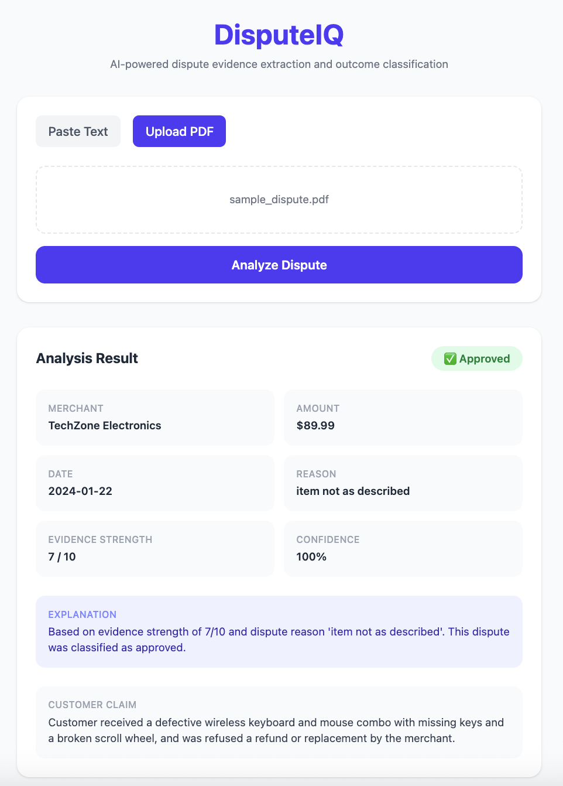
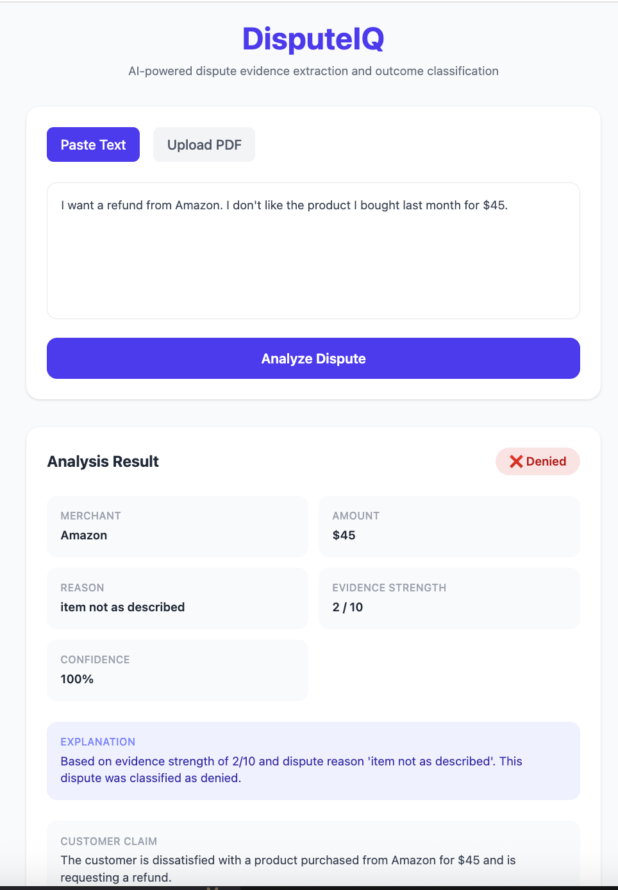

# DisputeIQ

An AI-powered dispute evidence processing pipeline that combines LLM-based structured extraction with machine learning classification to automate dispute resolution decisions.

## What it does

DisputeIQ accepts unstructured dispute evidence — either raw text or a PDF — and runs it through a two-stage pipeline:

1. **Evidence Extraction** — Claude (Anthropic) reads the raw input and extracts structured fields including merchant name, transaction amount, date, dispute reason, and an evidence strength score (1–10).
2. **Outcome Classification** — A LightGBM gradient-boosted classifier takes those structured fields and predicts one of three outcomes: `approved`, `denied`, or `needs_review`, along with a confidence score.

## Tech Stack

**Backend**
- FastAPI
- Anthropic Claude API (structured extraction + prompt engineering)
- LightGBM (tabular classification)
- PyPDF2 (unstructured document processing)
- Pydantic (data validation and response modeling)
- Python-dotenv

**Frontend**
- React (Vite)
- Tailwind CSS

## Project Structure

```
disputeiq/
├── backend/
│   ├── main.py          # FastAPI app and routes
│   ├── extractor.py     # Claude API integration and structured extraction
│   ├── classifier.py    # LightGBM model training and prediction
│   ├── models.py        # Pydantic data models
│   └── requirements.txt
└── frontend/
    └── src/
        ├── App.jsx
        ├── api.js
        └── components/
            ├── UploadForm.jsx
            ├── ResultsPanel.jsx
            └── DisputeCard.jsx
```
## Running Locally

**Backend**
```bash
cd backend
python3 -m venv venv
source venv/bin/activate
pip install -r requirements.txt
# Add your Anthropic API key to a .env file: ANTHROPIC_API_KEY=your_key_here
uvicorn main:app --reload
```

**Frontend**
```bash
cd frontend
npm install
npm run dev
```

## Example

Input:
I ordered headphones from SoundCo on 2024-03-10 for $149.99.

The item arrived broken and looks nothing like the photos.

I have photos as evidence.

Output:
```json
{
  "extracted": {
    "merchant_name": "SoundCo",
    "transaction_amount": 149.99,
    "transaction_date": "2024-03-10",
    "dispute_reason": "item_not_as_described",
    "customer_claim": "Customer received broken headphones that did not match product photos.",
    "evidence_strength": 7
  },
  "outcome": "approved",
  "confidence": 1.0
}
```
## Screenshot

